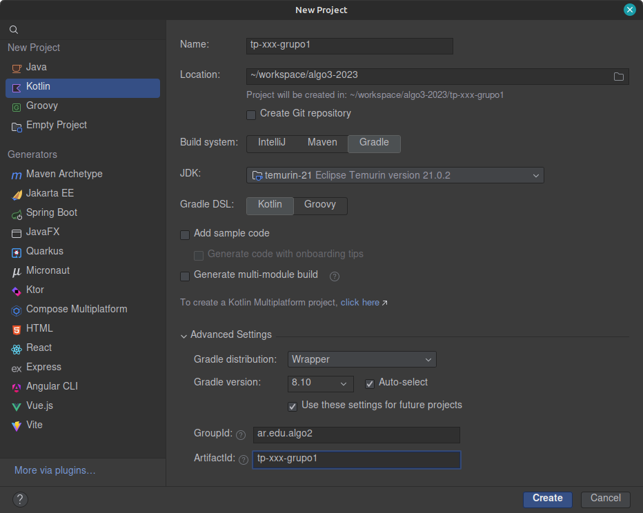
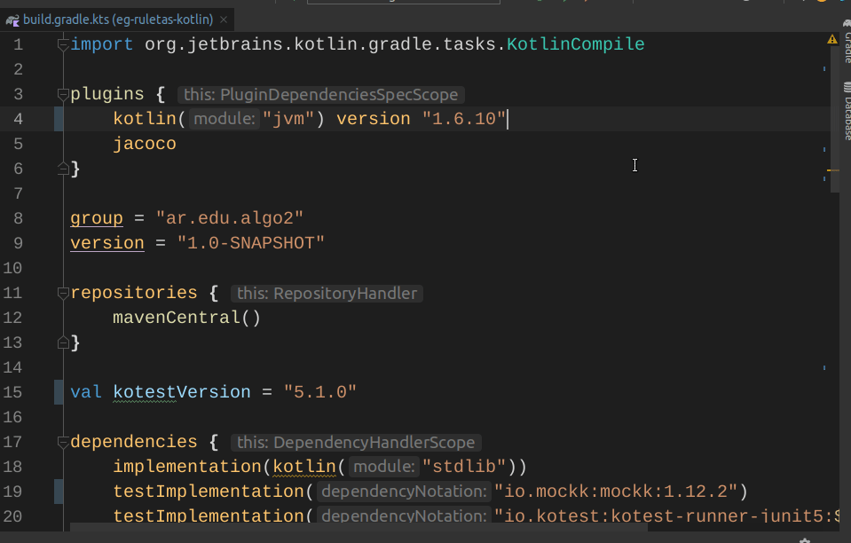
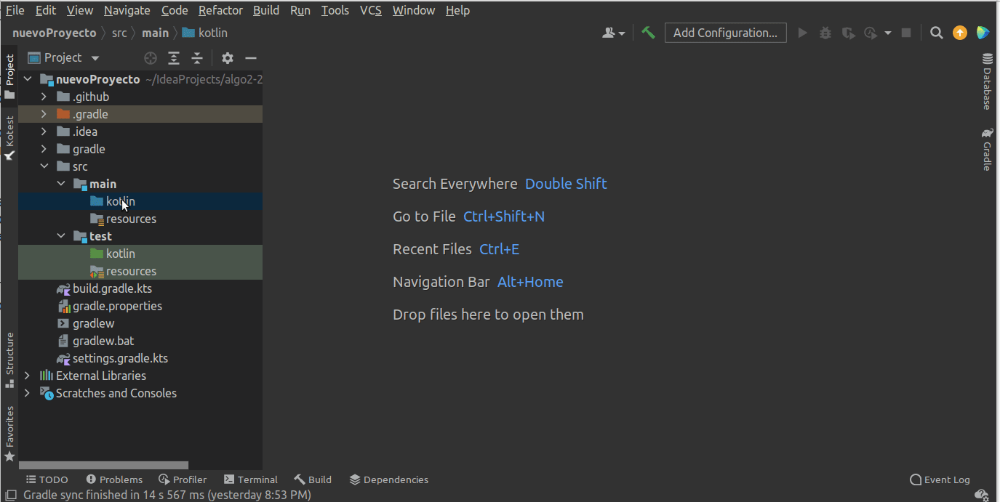
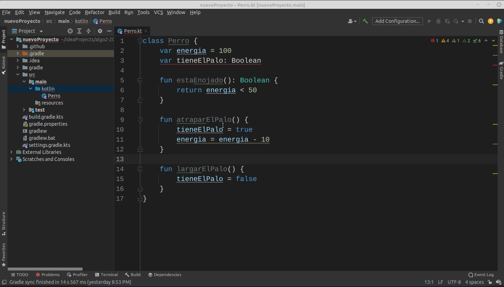
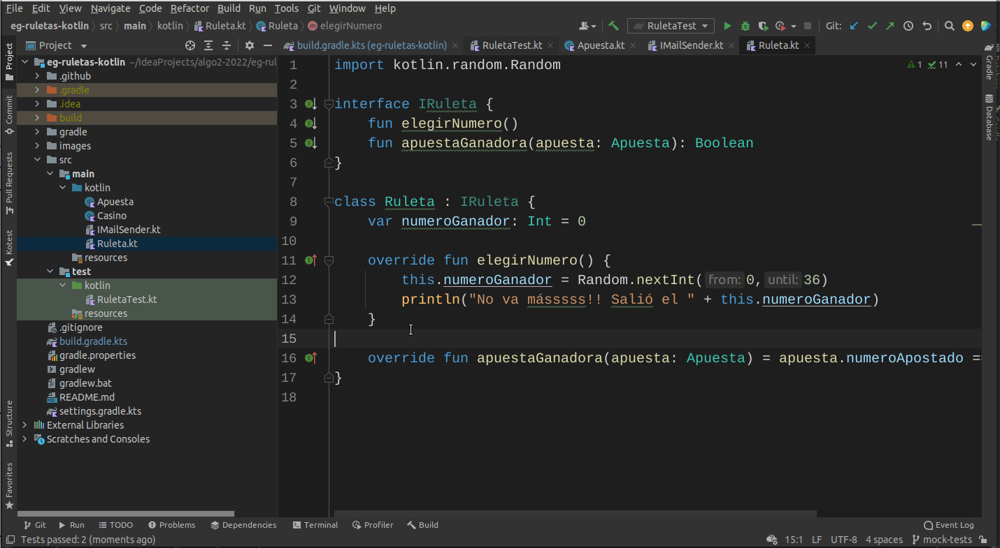
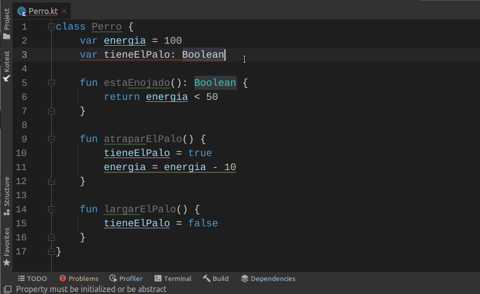
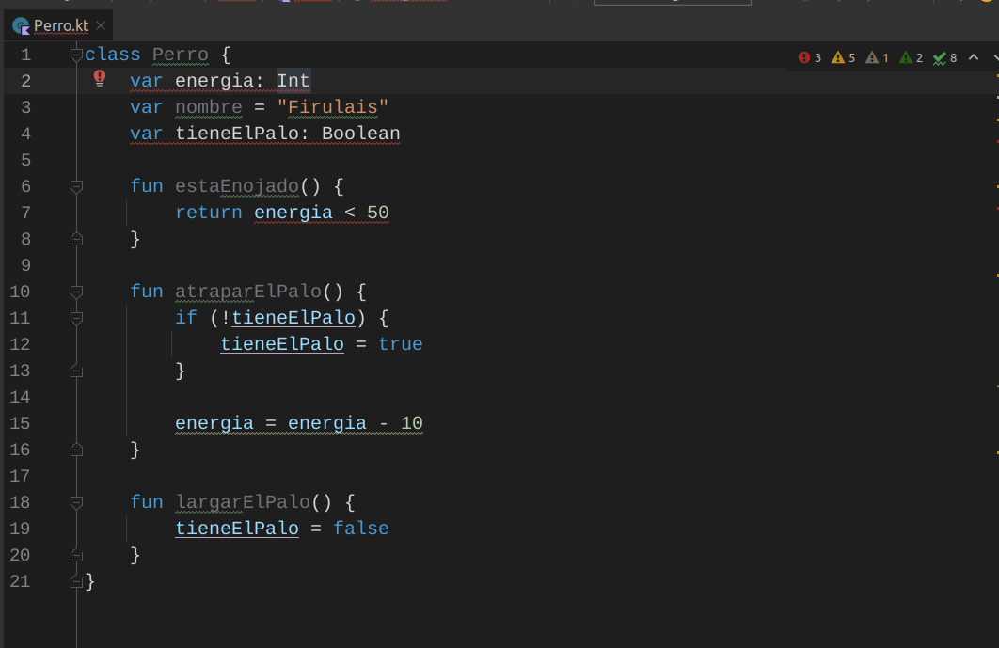
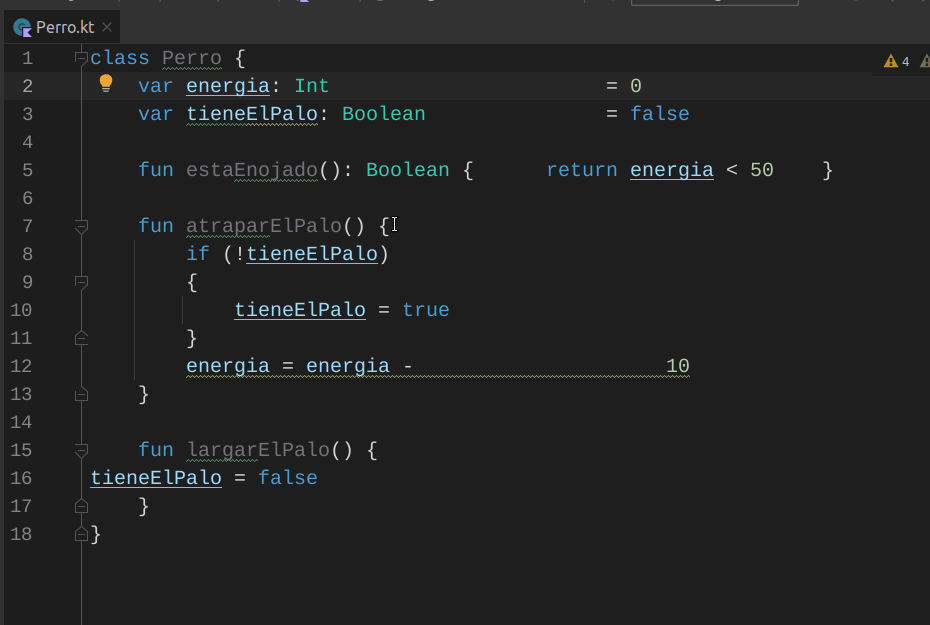
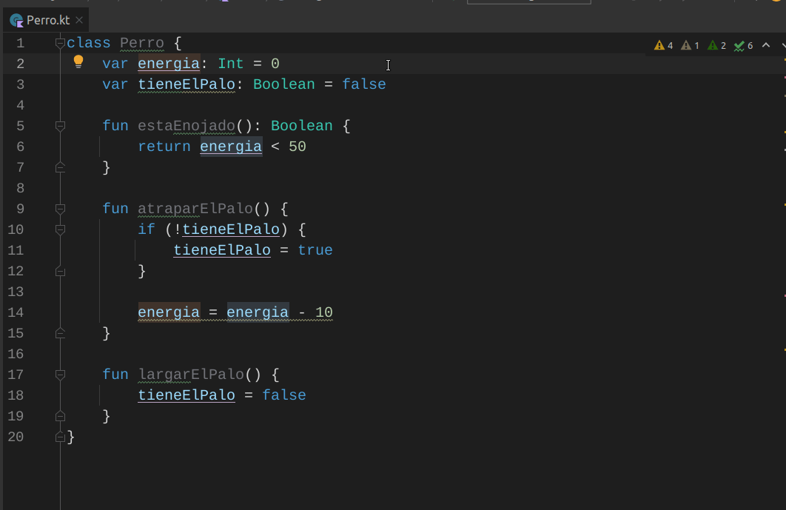

Para realizar las prácticas, vas a crear un proyecto desde cero. 

# Crear proyecto Kotlin

Desde IntelliJ tenemos dos opciones:

- sin ningún proyecto abierto, nos aparece un botón `New project`
- o bien si tenemos un proyecto abierto, tenemos que abrir el menú `File > New > Project...`

Eso abre la siguiente ventana de diálogo:



- El nombre del proyecto no debe contener espacios ni caracteres especiales (IntelliJ te va a avisar)
- Todos los ejemplos que vas a descargar de la materia, así como los proyectos en los que vas a trabajar, se basan en la tecnología **Gradle**. Asegurate que tengas seleccionada la opción `Gradle` en `Build System` y `Kotlin` para la opción `Gradle DSL`.
- Revisamos que la opción en `Project JDK` por defecto sea la **JDK 21**, en caso contrario debemos ir a [configurar la versión de Java](./kotlin-preparacion-de-un-entorno-de-desarrollo.md)
- Te recomendamos que el group id sea `ar.edu.zzzz.xxx` donde `zzzz` sea la universidad y `xxx` sea la materia que estás cursando. Por ejemplo `ar.edu.unsam.algo2` para la materia Algoritmos 2 de UNSAM. Esta opción está disponible si expandís el grupo "Advanced settings".
- El nombre del artefacto (Artifact ID) es el nombre de tu proyecto

Cuando finalizamos, se genera un proyecto con un archivo `build.gradle.kts`, que es fundamental para que IntelliJ lea esas definiciones para el proyecto en otra máquina y descargue las dependencias.

## Archivo de configuración de Gradle

Te dejamos un archivo con las dependencias base para la cursada de Algoritmos 2 (UNSAM) del aǹo 2026: [build.gradle.kts de ejemplo](algo2.build.gradle.kts). Luego tendrás que

- renombrar el archivo a `build.gradle.kts`
- copiarlo al directorio raíz de tu proyecto ya creado
- revisar el _groupId_ para ver si es el adecuado
- revisar las dependencias para ver si es necesario agregar algún elemento más

Una vez que actualicemos ese archivo, desde IntelliJ nos aparecerán dos íconos para indicarnos que debemos sincronizar las definiciones de Gradle con las de nuestro IDE:



Al hacer click automáticamente se actualizarán las dependencias. Este proceso es muy importante ya que de otra manera podremos experimentar problemas como imports que no funcionan, o métodos que no se pueden encontrar (por estar usando versiones diferentes a las que queremos realmente).


## Continuous integration

Por el momento, lo que necesitás es únicamente copiar [este archivo](./algo2.build.yml) en la siguiente estructura que **hay que crear**

```bash
<directorio raíz>
└── .github
    └── workflows
        └── build.yml
```

Para más información podés consultar la página [de integración continua para proyectos en Kotlin](./kotlin-ci.md).

## Primeros pasos

Vamos a crear nuestra primera clase Perro. Es importante notar que tendremos dos carpetas donde ubicaremos los fuentes:

- `src/main/kotlin`: donde irán las clases
- `src/test/kotlin`: donde irán los tests

Por eso, nos ubicamos en `src/main/kotlin` y con un botón derecho, seleccionaremos `New > Kotlin Class/File`.




## Shortcuts de IntelliJ

A continuación te dejamos algunas recomendaciones para que tu estadía en IntelliJ + Kotlin sea más feliz:

- "Cómo era para...?" Lo mejor es preguntarle al propio IDE, **presionando dos veces `Shift` + `Shift`**. Desde esa ventana de diálogo podés buscar cualquier palabra clave, como "New", "Save", "Run", "Select".



<!-- -->

___

- Presionar dos veces `Ctrl` + `Ctrl` te permite ejecutar cualquier comando válido desde el componente donde estés ubicado.



<!-- -->

___

- `Alt` + `Enter` activa sugerencias tanto para errores como para cosas que se pueden mejorar (_warnings_).



Presionando la tecla `F2` te podés mover al siguiente lugar del archivo donde hay un error o warning:



<!-- -->

___

- Nunca nos olvidemos de que nuestro código tiene que ser entendible para el resto de la humanidad y lo mejor es pedirle al IDE que lo haga mediante `Ctrl` + `Alt` + `L` o bien con `Ctrl` + `Alt` + `Shift` + `L` (te abre una ventana de diálogo con más opciones). 



**Tip**: si estás trabajando en una distribución de Linux que utiliza KDE, el shortcut `Ctrl` + `Alt` + `L` es tomado por el sistema como la acción para bloquear la pantalla. Para desactivarlo seguí [estas instrucciones](https://stackoverflow.com/questions/211043/disable-global-ctrl-alt-l-hotkey-in-kde).

La configuración base se puede definir mediante `File` > `Settings` y luego: `Editor` > `Code Style` > `Kotlin`, aunque **te recomendamos que dejes los valores por defecto, así como recomendamos que todas las personas tengan la misma configuración**.

<!-- -->
___

Por último, dos muy buenas opciones para seleccionar elementos son

- `Ctrl` + `Alt` + `Shift` + `J`: selecciona todas las ocurrencias de un elemento (para renombrarlo existe otro shortcut, `Shift` + `F6`)
- `Alt` + `J`: permite ir seleccionando elementos similares uno por uno.




<!-- -->
___

Otros comandos útiles:

- `Ctrl` + `D`: duplica una línea
- `Ctrl` + `Y`: elimina una línea

Si estás trabajando con Mac los shortcuts son diferentes, en ese caso o bien para más información podés ver [este artículo](https://blog.jetbrains.com/idea/2020/03/top-15-intellij-idea-shortcuts/).

## Packages para agrupar código común

- Utilización de packages (paquetes). Es una buena práctica agrupar las clases afines en paquetes para organizar semánticamente el código. No hay una guía firme a seguir con respecto a cómo organizar nuestros archivos, ya que suele depender del contexto en el cual estamos trabajando, pero a medida que veas nuestros ejemplos y vayas haciendo las prácticas notarás que hay clases que se pueden agrupar en contextos similares. Te dejamos un ejemplo

```bash
proyecto
   ├── home
   ├── registration
   │   ├── Profile.kt
   │   └── User.kt
   └── settings
       ├── CustomPrivacy.kt
       ├── DefaultPrivacy.kt
       ├── Privacy.kt
       └── Setting.kt
```

De esta manera, logramos mayor granularidad en la organización de nuestras clases.


# Links útiles

* [Video en youtube que explica cómo crear un proyecto Kotlin desde cero](https://youtu.be/A29JekWnlJw)
* [Cómo trabajar con el control de versiones](kotlin-amigandonos-git.md)
* [Cómo importar un proyecto Kotlin con Gradle](kotlin-bajar-un-proyecto-gradle-de-un-repositorio-git.md)
* [Volver al menú principal del entorno Kotlin](kotlin-principal.md)

